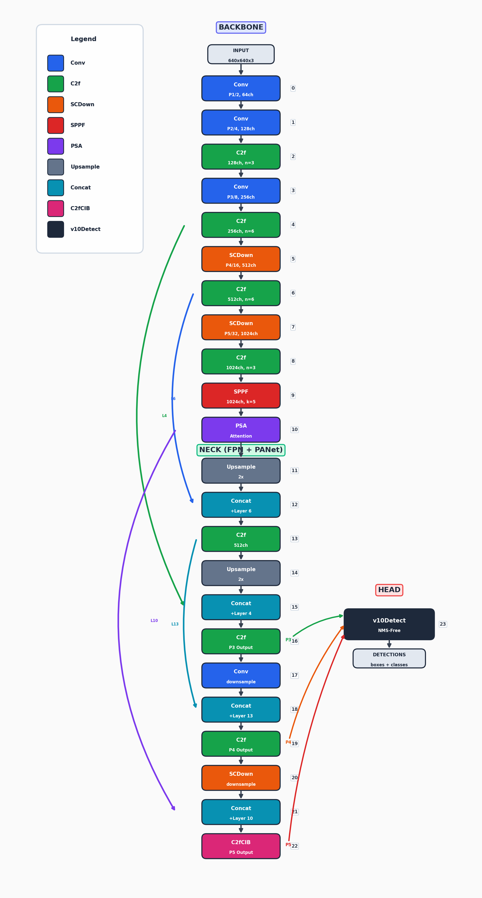

# **YOLOv10 Architecture Summary**

---

## YAML Format Structure

Each layer is defined as: `[from, repeats, module, args]`

| Parameter | Description |
|-----------|-------------|
| **from** | Input source (`-1` = previous layer, or layer index, or list for multiple inputs) |
| **repeats** | How many times to repeat this module |
| **module** | The class/module type to instantiate |
| **args** | Arguments passed to the module constructor |

---

## Module Classes and Locations

> All modules are located in the `ultralytics/nn/modules/` directory.

| Module | File | Description |
|:-------|:-----|:------------|
| `Conv` | `conv.py:37` | Standard Conv + BatchNorm + SiLU |
| `C2f` | `block.py:277` | CSP Bottleneck with 2 convolutions (faster) |
| `SPPF` | `block.py:199` | Spatial Pyramid Pooling - Fast |
| `PSA` | `block.py:1383` | Position-Sensitive Attention |
| `SCDown` | `block.py:1539` | Spatial-Channel Decoupled Downsampling |
| `C2fCIB` | `block.py:1236` | C2f with Compact Inverted Block |
| `Concat` | `conv.py:655` | Tensor concatenation |
| `v10Detect` | `head.py:841` | YOLOv10 detection head |

---

## Backbone (Layers 0-10)

| Layer | YAML | Class | Args | Description |
|:-----:|:-----|:------|:-----|:------------|
| 0 | `[-1, 1, Conv, [64, 3, 2]]` | Conv | `c2=64, k=3, s=2` | Stem layer, P1/2 downsample |
| 1 | `[-1, 1, Conv, [128, 3, 2]]` | Conv | `c2=128, k=3, s=2` | P2/4 downsample |
| 2 | `[-1, 3, C2f, [128, True]]` | C2f | `c2=128, shortcut=True` | 3x Bottleneck with shortcuts |
| 3 | `[-1, 1, Conv, [256, 3, 2]]` | Conv | `c2=256, k=3, s=2` | P3/8 downsample |
| 4 | `[-1, 6, C2f, [256, True]]` | C2f | `c2=256, shortcut=True` | 6x Bottleneck with shortcuts |
| 5 | `[-1, 1, SCDown, [512, 3, 2]]` | SCDown | `c2=512, k=3, s=2` | Efficient downsample, P4/16 |
| 6 | `[-1, 6, C2f, [512, True]]` | C2f | `c2=512, shortcut=True` | Feature extraction at P4 |
| 7 | `[-1, 1, SCDown, [1024, 3, 2]]` | SCDown | `c2=1024, k=3, s=2` | Efficient downsample, P5/32 |
| 8 | `[-1, 3, C2f, [1024, True]]` | C2f | `c2=1024, shortcut=True` | Deep feature extraction |
| 9 | `[-1, 1, SPPF, [1024, 5]]` | SPPF | `c2=1024, k=5` | Multi-scale context |
| 10 | `[-1, 1, PSA, [1024]]` | PSA | `c=1024` | **Attention module** |

---

## Head / Neck (Layers 11-23)

| Layer | YAML | Class | Args | Description |
|:-----:|:-----|:------|:-----|:------------|
| 11 | `[-1, 1, nn.Upsample, [None, 2, "nearest"]]` | Upsample | `scale=2` | 2x upsampling |
| 12 | `[[-1, 6], 1, Concat, [1]]` | Concat | `dim=1` | Merge with backbone P4 (FPN) |
| 13 | `[-1, 3, C2f, [512]]` | C2f | `c2=512` | Feature fusion |
| 14 | `[-1, 1, nn.Upsample, [None, 2, "nearest"]]` | Upsample | `scale=2` | 2x upsampling |
| 15 | `[[-1, 4], 1, Concat, [1]]` | Concat | `dim=1` | Merge with backbone P3 |
| 16 | `[-1, 3, C2f, [256]]` | C2f | `c2=256` | **P3/8 output** (small objects) |
| 17 | `[-1, 1, Conv, [256, 3, 2]]` | Conv | `c2=256, k=3, s=2` | PANet downsample |
| 18 | `[[-1, 13], 1, Concat, [1]]` | Concat | `dim=1` | Merge with head P4 |
| 19 | `[-1, 3, C2f, [512]]` | C2f | `c2=512` | **P4/16 output** (medium objects) |
| 20 | `[-1, 1, SCDown, [512, 3, 2]]` | SCDown | `c2=512, k=3, s=2` | Efficient downsample |
| 21 | `[[-1, 10], 1, Concat, [1]]` | Concat | `dim=1` | Merge with PSA output |
| 22 | `[-1, 3, C2fCIB, [1024, True, True]]` | C2fCIB | `c2=1024, lk=True` | **P5/32 output** (large objects) |
| 23 | `[[16, 19, 22], 1, v10Detect, [nc]]` | v10Detect | `nc=80` | Detection head (NMS-free) |

---

## Detailed Class Architectures

### Conv (Standard Convolution Block)

```
Input -> Conv2d -> BatchNorm2d -> SiLU -> Output
```

| Argument | Description | Default |
|:---------|:------------|:--------|
| `c1` | Input channels | - |
| `c2` | Output channels | - |
| `k` | Kernel size | 1 |
| `s` | Stride | 1 |
| `p` | Padding | auto |
| `g` | Groups | 1 |
| `act` | Activation | SiLU |

---

### C2f (CSP Bottleneck with 2 Convolutions - Faster)

```
Input → Conv1×1 → Split
                   ├── Chunk A: pass through
                   └── Chunk B: Bottleneck×n
              → Concat all → Conv1×1 → Output
```

| Argument | Description | Default |
|:---------|:------------|:--------|
| `c1` | Input channels | - |
| `c2` | Output channels | - |
| `n` | Number of Bottleneck blocks | - |
| `shortcut` | Use residual connections | True |
| `g` | Groups | 1 |
| `e` | Expansion ratio | 0.5 |

---

### SPPF (Spatial Pyramid Pooling - Fast)

```
Input → Conv1×1 → MaxPool5×5 → MaxPool5×5 → MaxPool5×5
                → Concat(original + 3 pooled) → Conv1×1 → Output
```

> **Purpose:** Captures multi-scale spatial context. Equivalent to SPP(k=5,9,13) but faster.

| Argument | Description | Default |
|:---------|:------------|:--------|
| `c1` | Input channels | - |
| `c2` | Output channels | - |
| `k` | MaxPool kernel size | 5 |

---

### PSA (Position-Sensitive Attention)

```
Input -> Conv1x1 -> Split(a, b)
                   |-- a: pass through
                   +-- b: Attention(QKV + PE) -> FFN
              -> Concat(a, b) -> Conv1x1 -> Output
```

> **Attention Details:**
> - Multi-head self-attention with learnable positional encoding
> - `num_heads = c // 64`
> - `attn_ratio = 0.5`

| Argument | Description | Default |
|:---------|:------------|:--------|
| `c1` | Input channels | - |
| `c2` | Output channels (must equal c1) | - |
| `e` | Expansion ratio | 0.5 |

---

### SCDown (Spatial-Channel Decoupled Downsampling)

```
Input → Conv1×1 (channel mixing) → DepthwiseConv (spatial downsample) → Output
```

> **Purpose:** More efficient than standard strided convolution by separating channel transformation and spatial downsampling.

| Argument | Description |
|:---------|:------------|
| `c1` | Input channels |
| `c2` | Output channels |
| `k` | Kernel size |
| `s` | Stride |

---

### C2fCIB (C2f with Compact Inverted Block)

```
Same as C2f, but Bottleneck replaced with CIB:

CIB: Input → DWConv3×3 → Conv1×1 → Conv1×1 → DWConv3×3 → +shortcut → Output
```

> When `lk=True`, uses large kernel (7×7) via RepVGGDW for expanded receptive field.

| Argument | Description | Default |
|:---------|:------------|:--------|
| `c1` | Input channels | - |
| `c2` | Output channels | - |
| `n` | Number of CIB modules | - |
| `shortcut` | Use residual connections | True |
| `lk` | Use large kernel convolutions | False |
| `e` | Expansion ratio | 0.5 |

---

### v10Detect (YOLOv10 Detection Head)

```
3 input scales (P3, P4, P5) -> Each scale:
  |-- Box head: DWConv -> Conv -> DWConv -> Conv -> Conv2d(4 x reg_max)
  +-- Cls head: DWConv+Conv -> DWConv+Conv -> Conv2d(num_classes)
```

**Dual Label Assignment:**

| Mode | Head | Description |
|:-----|:-----|:------------|
| Training | one2many | Multiple predictions per object |
| Inference | one2one | Single best prediction (**NMS-free**) |

| Argument | Description | Default |
|:---------|:------------|:--------|
| `nc` | Number of classes | 80 (COCO) |
| `ch` | Input channel sizes from P3, P4, P5 | - |

---

## Model Scaling

The `scales` parameter in the YAML controls model size:

| Variant | Depth | Width | Max Channels |
|:--------|:-----:|:-----:|:------------:|
| **n** (Nano) | 0.33 | 0.25 | 1024 |
| **s** (Small) | 0.33 | 0.50 | 1024 |
| **m** (Medium) | 0.67 | 0.75 | 768 |
| **b** (Base) | 0.67 | 1.00 | 512 |
| **l** (Large) | 1.00 | 1.00 | 512 |
| **x** (XLarge) | 1.00 | 1.25 | 512 |

- **depth**: Multiplier for number of layer repeats
- **width**: Multiplier for channel counts
- **max_channels**: Maximum channel limit

---

## Architecture Diagram



---

## Key YOLOv10 Innovations

| Innovation | Description |
|:-----------|:------------|
| **NMS-Free Detection** | Dual label assignment with one2one head for inference |
| **PSA** | Position-Sensitive Attention for enhanced P5 features |
| **SCDown** | Efficient spatial-channel decoupled downsampling |
| **C2fCIB** | Compact Inverted Blocks for improved efficiency |
| **Lightweight Cls Head** | Reduced computational cost in classification |
| **End-to-End** | No post-processing required during inference |
